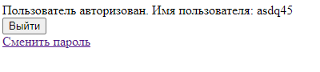

**Лабораторная работа №1**

# **Основное задание**
Спроектировать и разработать систему авторизации пользователей на протоколе HTTP. Система должна обладать следующим функционалом:

Функциональность входа и выхода

Пароли должны хранится в хешированном виде

# **Дополнительные задания**
В качестве дополнительного функционала можно реализовать следующие задачи:
**Форма регистрации
Возможность смены пароля
Возможность восстановления пароля
Ограничение времени сессии на стороне сервера Ограничение срока действия пароля на стороне сервера
Хранение хеша пароля с солью** 
==================================================================================================
# **Ход работы**

1. ## **Разработка пользовательского интерфейса**

Главное меню:

Страница регистрации:

Страница входа

Страница авторизованного пользователя:

1. ## **Описание пользовательских сценариев работы**
На сайте пользователю доступны следующие возможности:

Регистрация

Авторизация

При вводе неверных данных, пользователю выводится сообщение об ошибке. После авторизации пользователю открываются следующие возможности:

Смена пароля Выход из аккаунта
1. ## **Описание API сервера и хореографии**
Пример запросов, когда пользователь впервые заходит на страницу home\_page.html, а  после регистрируется:

Пример запросов, когда пользователь заходит на страницу авторизации, регистрируется, а затем авторизируется

Пример запросов, когда пользователь пытается сменить пароль

1. ## **Описание структуры базы данных**
Для хранения данных пользователей используется база данных Sqlite3. В таблице с пользователями хранится основная информация, такая как: Порядковый номер пользователя, зашифрованный пароль, последний вход, дата регистрации и юзернейм

Примеры данных пользователей в базе данных:

1. ## **Описание алгоритмов**
## Описание работы программы в виде блок схемы

# **Значимые фрагменты кода**
Фрагмент кода представлений:

class MainPageView(TemplateView):
`    `template\_name = 'authorization/home\_page.html'

class UserCreateView(CreateView):
`    `model = CustomUser
`    `form\_class = CustomUserCreationForm
`    `template\_name = 'authorization/registration\_page.html'
`    `success\_url = reverse\_lazy('login\_page')

class UserLogin(LoginView):
`    `form\_class = LoginUserForm
`    `template\_name = 'authorization/login\_page.html'
`    `redirect\_authenticated\_user = reverse\_lazy('login\_page')

class ChangePasswordView(PasswordChangeView):
`    `form\_class = PasswordChangeForm
`    `template\_name = 'authorization/change\_password.html'
`    `success\_url = reverse\_lazy('home')

def logout\_user(request):
`    `logout(request)
`    `return redirect('home')

Фрагмент кода модели пользователя

class CustomUser(AbstractUser):
`    `username = models.CharField(max\_length=12, unique=True)
`    `USERNAME\_FIELD = 'username'

`    `def *\_\_str\_\_*(self):
`        `return self.username

`    `def save(self, \*args, \*\*kwargs):
`        `self.crew\_password = make\_password(self.password)
`        `super(CustomUser, self).save(\*args, \*\*kwargs)

Фрагмент кода html форм для авторизации и регистрации:

class CustomUserCreationForm(UserCreationForm):
`    `username = forms.CharField(widget=forms.TextInput(attrs={'class': 'form-control', 'placeholder': 'Логин'}), label='Логин')
`    `password1 = forms.CharField(widget=forms.PasswordInput(attrs={'class': 'form-control', 'placeholder': 'Пароль'}), label='Пароль')
`    `password2 = forms.CharField(widget=forms.PasswordInput(attrs={'class': 'form-control', 'placeholder': 'Повторение пароля'}), label='Повторение пароля')

`    `class Meta:
`        `model = CustomUser
`        `fields = UserCreationForm.Meta.fields + ('username', 'password1', 'password2')

class LoginUserForm(AuthenticationForm):
`    `username = forms.CharField(widget=forms.TextInput(attrs={'class': 'form-control', 'placeholder': 'Логин'}), label='Логин')
`    `password = forms.CharField(widget=forms.PasswordInput(attrs={'class': 'form-control', 'placeholder': 'Пароль'}), label='Пароль')

